# ⏰ 복둥이의 시간여행 (Time Travel with Bokdung-i)

**AR 기반 유물 탐험·체험 학습 콘텐츠**

“복둥이의 시간여행”은 가야시대 친구들과 함께 유물을 찾아가는 스토리형 AR 학습 앱입니다.
사용자는 실제 전시 공간에서 모바일 카메라를 활용해 안내판 속 유물을 찾아 촬영하고,
캐릭터와의 대화 및 퀘스트를 수행하며 자연스럽게 역사를 배우는 체험형 교육 콘텐츠입니다.

---

## 📅 개발 개요

| 구분             | 내용                                                                                                                                                                                                                     |
| -------------- | ---------------------------------------------------------------------------------------------------------------------------------------------------------------------------------------------------------------------- |
| **개발 기간 / 역할** | **2021.09 \~ 2021.12 (총 4개월)**<br>외주 프로젝트 (단독 개발)<br>UI/UX 설계 · 애니메이션 연출 · AR 인식 · 사운드 시스템 구현                                                                                                                          |
| **기술 스택**      | Unity 2022.3 LTS<br>**Vuforia** – AR 마커 인식<br>**DOTween** – UI 애니메이션<br>**UnityEngine.Video / RenderTexture** – 영상 재생<br>**AudioMixer, AudioSource** – 오디오 관리<br>**PlayerPrefs** – 데이터 저장<br>**플랫폼** – Android (전시 배포) |
| **주요 기여**      | - AR 카메라 기반 유물 인식 및 판별 시스템 구현<br>- 캐릭터별 퀘스트 로직 및 대화 연출 설계/개발<br>- UI 애니메이션 및 사운드 시스템 통합<br>- 오프닝/엔딩 영상 및 튜토리얼 흐름 제어<br>- 전시관 환경에 맞춘 QA 및 최적화                                                                           |

## 💡 주요 기능 설명

| 기능 구분          | 설명                                        |
| -------------- | ----------------------------------------- |
| **AR 유물 인식**   | 실제 전시 공간에서 카메라로 유물 안내판을 스캔해 일치 여부 판정      |
| **퀘스트 진행 시스템** | 캐릭터와 대화를 통해 특정 유물을 찾는 미션 수행               |
| **캐릭터 상호작용**   | 복둥이 및 가야 친구들과의 대화형 UI, 상황별 피드백 제공         |
| **진행도/완료 시스템** | 찾은 유물은 ‘찾기 완료’ 표시, 모든 퀘스트 완료 시 클리어 메시지 출력 |

## 📸 게임 주요 화면

| 화면           | 설명                       | 이미지                           |
| ------------ | ------------------------ | ----------------------------- |
| **타이틀 화면**   | 게임 시작, 복둥이와 시간여행 출발      | 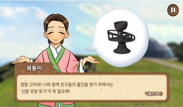   |
| **캐릭터 소개**   | 복둥이와 가야 친구들의 등장, 퀘스트 안내  | 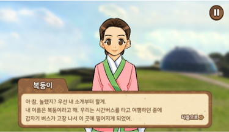 |
| **유물 찾기 안내** | 카메라로 유물 안내판을 스캔하는 미션     | 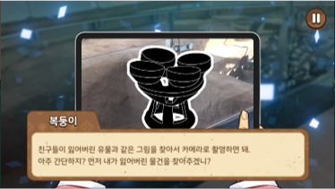  |
| **퀘스트 진행**   | 캐릭터와의 대화로 힌트 및 피드백 제공    | 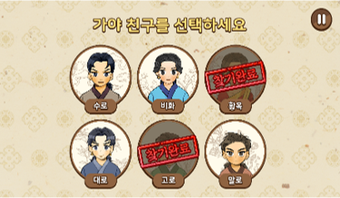   |
| **선택 화면**    | 친구 선택 후 개별 퀘스트 수행        | 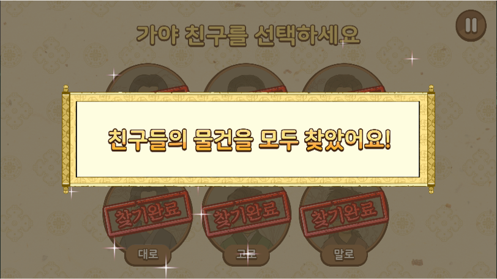    |
| **진행 완료**    | 모든 친구의 유물 퀘스트 완료 시 결과 출력 | 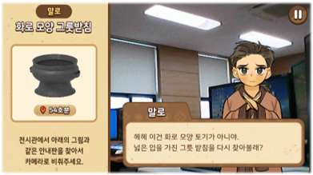    |


## 🎞️ 시연 GIF

| 설명              | 이미지                                                                 |
| --------------- | ------------------------------------------------------------------- |
| **AR 유물 인식 예시** | 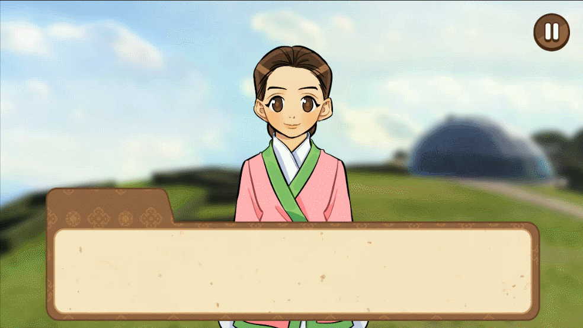 |
| **유물 퀘스트 진행**   | 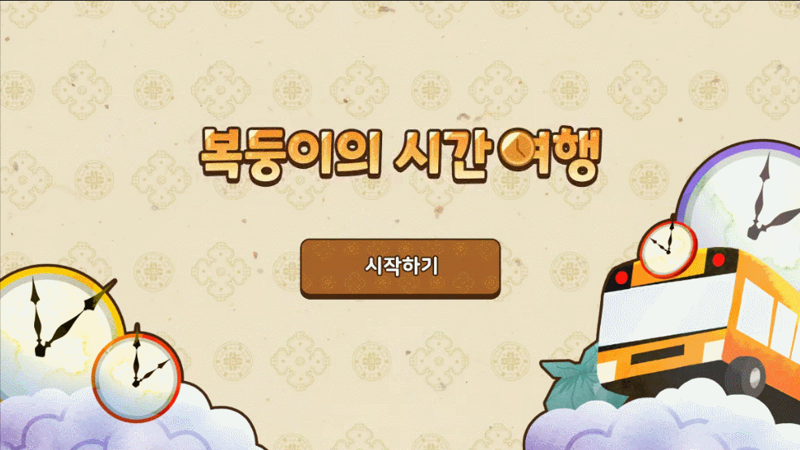 |
| **캐릭터 대화 예시**   | 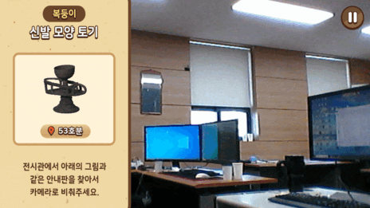 |
| **퀘스트 완료 장면**   |  |

## 📎 캐릭터별 AR 마커

| 복둥이 (신발 모양 토기)                                           | 수로 (고리자루칼)                                    | 비화 (굽다리 접시)                                           | 황옥 (목걸이)                                                | 대로 (재갈)                                               | 고로 (투구)                                              | 말로 (화로 모양 그릇 받침)                                      |
| -------------------------------------------------------- | --------------------------------------------- | ----------------------------------------------------- | ------------------------------------------------------- | ----------------------------------------------------- | ---------------------------------------------------- | ----------------------------------------------------- |
| 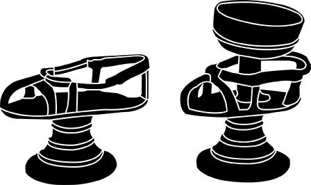 | 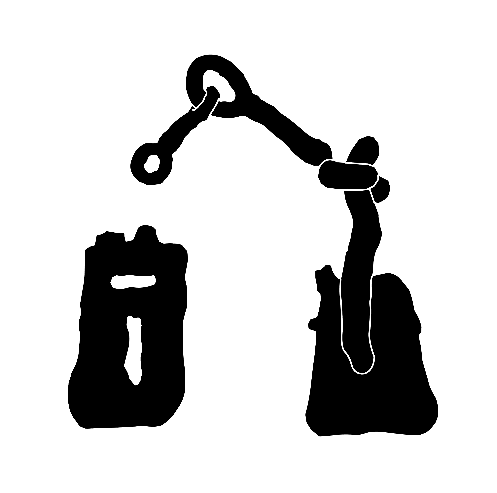 |  | 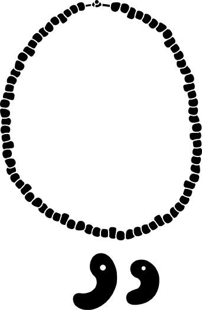 |  |  |  |


## 🔍 코드 구조 (일부)

| 클래스                                           | 설명                       |
| --------------------------------------------- | ------------------------ |
| `GameManager.cs`                              | 전체 게임 흐름 및 상태 관리         |
| `DialogManager.cs`                            | 대화창, 타이핑 연출, 나레이션 타이밍 제어 |
| `SoundManager.cs`                             | BGM, 효과음, 캐릭터 나레이션 관리    |
| `MissionCheck.cs`                             | 마커 인식 결과에 따른 유물 판별       |
| `Game_[캐릭터].cs`                               | 캐릭터별 퀘스트 진행 및 애니메이션      |
| `Tutorial_UIManager.cs`, `Title_UIManager.cs` | 씬 전환, 영상 재생, 튜토리얼 제어     |

```csharp
// 유물 인식 판별
if (imgTarget[2].CurrentStatus == TrackableBehaviour.Status.TRACKED)
{
    findRelicState = true;
    RelicAcquirePopup();
}

// 대화 타이핑 + 사운드 연동
Dialog_TM.DOText(dialog_str, Typing_speed);
SoundManager.Instance.PlayCharacterDialog("복둥이 1", 8f);
```
